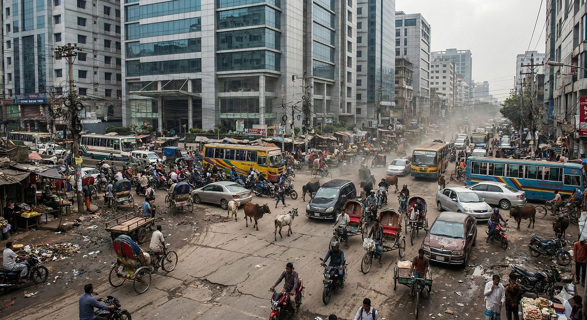
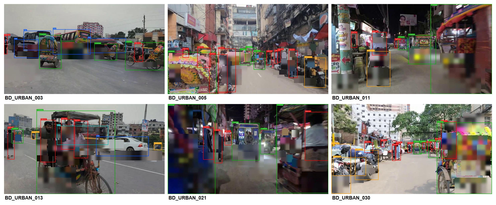
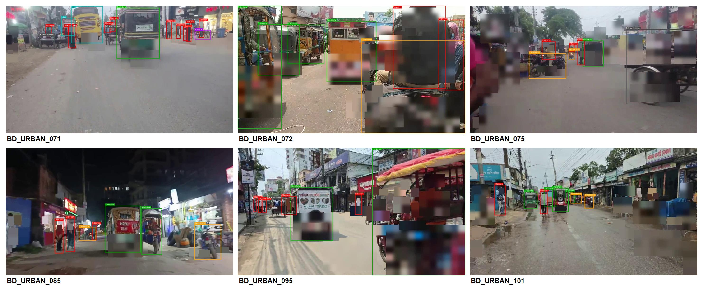

# Bangladesh Rickshaw Traffic Dataset (Free Sample)


> High-quality urban traffic video dataset from Bangladesh for **Physical AI**, **Robotics**, **ADAS**, **Computer Vision**, **Autonomous Driving**, and **Object Detection** research.

---

# Free Sample

This repository provides a **free sample** of the Bangladesh Rickshaw Traffic Dataset developed by **Origin Data Lab**.

It is designed for researchers, AI startups, robotics companies, universities, and enterprise teams evaluating real-world traffic datasets from emerging markets.

---

# Why This Dataset?

Unlike traditional driving datasets collected in structured road environments, this dataset focuses on one of the world's most complex urban mobility ecosystems.

It contains:

- Rickshaws
- Motorcycles
- Cars
- Trucks
- Buses
- Pedestrians
- Mixed traffic
- Dense intersections
- Market roads
- Urban mobility scenarios

These environments are valuable for:

- Physical AI
- Robotics perception
- Autonomous navigation
- ADAS validation
- Object Detection
- Traffic scene understanding

---

# Dataset Preview

## Hero Image



---

## Human GT Preview

### Page 1



### Page 2



---

# Dataset Highlights

- Bangladesh Urban Traffic
- Dhaka Metropolitan Area
- Privacy Processed
- Human GT Preview Included
- Enterprise Release Pipeline
- Metadata Included
- Commercial License Available

---

# Technical Overview

| Item | Value |
|-------|-------|
| Country | Bangladesh |
| City | Dhaka |
| Dataset Type | Urban Traffic Video |
| Video Format | MP4 |
| Annotation | Human GT Preview |
| Privacy | Faces & License Plates Blurred |
| Metadata | Included |
| License | Evaluation Sample |

---

# Target Applications

This dataset is suitable for:

- Physical AI
- Robotics
- Autonomous Driving
- ADAS
- Computer Vision
- Object Detection
- Scene Understanding
- Smart City
- Urban Mobility Research
- Machine Learning

---

# Why Bangladesh?

Bangladesh offers one of the world's most challenging traffic environments.

Unlike highly structured road systems, Bangladesh provides:

- Dense traffic
- Rickshaw-dominant roads
- Mixed mobility
- Complex pedestrian interactions
- High object diversity
- Urban edge cases

These characteristics make the dataset valuable for developing robust AI perception systems.

---

# Commercial Dataset

The complete commercial dataset contains significantly more data, metadata, and enterprise documentation than this free sample.

Commercial packages are intended for:

- Enterprise AI
- Robotics Companies
- Physical AI
- ADAS Development
- Autonomous Vehicle Research
- Universities
- Government Research

---

# Repository Structure

```
preview/
docs/
examples/

README.md
```

---

# Documentation

Additional documentation is available inside:

```
docs/
```

Including:

- Quality Assurance
- Privacy Report

---

# Metadata Examples

Metadata examples are provided in:

```
examples/
```

---

# Download the Free Dataset

The complete free sample is available on Hugging Face.

(Official Hugging Face dataset link will be added here.)

---

# Commercial Licensing

Commercial licensing is available through Origin Data Lab.

For enterprise evaluation, licensing, or partnerships, please contact us.

---

# Origin Data Lab

Origin Data Lab develops high-quality real-world datasets for:

- Physical AI
- Robotics
- Computer Vision
- Autonomous Driving
- ADAS
- Smart Mobility

---

# Keywords

Bangladesh Traffic Dataset

Rickshaw Dataset

Urban Traffic Dataset

Physical AI Dataset

Robotics Dataset

Computer Vision Dataset

Autonomous Driving Dataset

ADAS Dataset

Object Detection Dataset

Urban Mobility Dataset

Emerging Market Traffic Dataset

Mixed Traffic Dataset

Dhaka Traffic Dataset

AI Training Dataset

Machine Learning Dataset

---

⭐ If this project is useful, please consider starring the repository.
